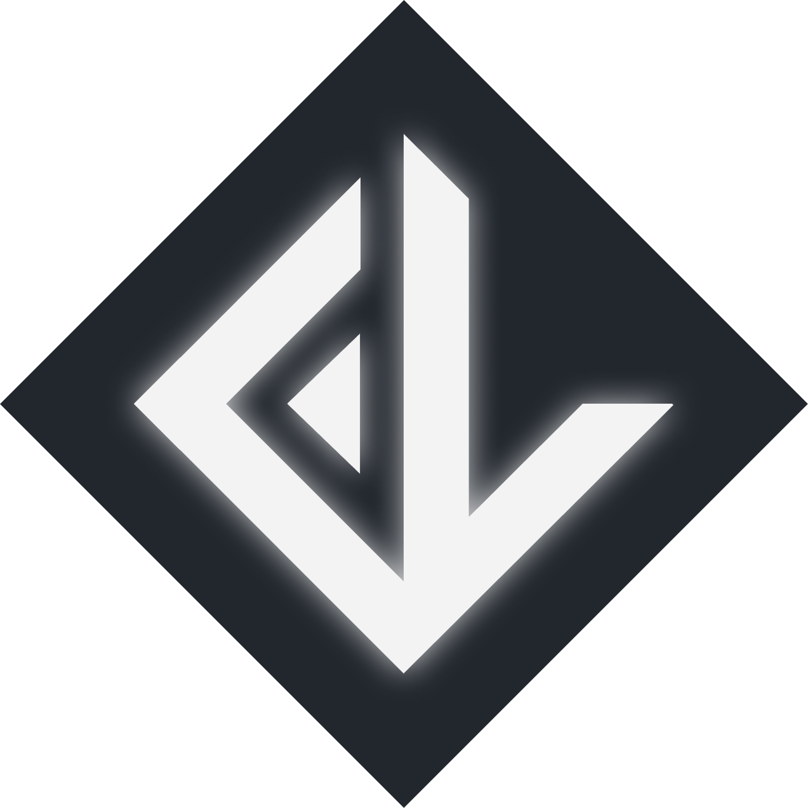

## Hey ! 👋 Je suis Fábio R. LOPES  !

 

  <li> Développeur web</li>
  <li> Passionné, dynamique, curieux et créatif </li>
  <li> Polyvalent et véritable couteux suisse </li>
  <li> Appétence pour le front-end </li>
  <li> Préférence pour framework Vue.js </li>
  <li> Cherche constamment à améliorer mes compétences </li>

 

### Stack technique :

 

  
  
  
  
  
  
  
  
  

   
  
  
  
  
  

----

| &nbsp;&nbsp;&nbsp; Prochainement mon portfolio : [www.fabiolopes.fr](https://www.fabiolopes.fr/)

----

 

  <a href="https://github.com/FabioDevCode">
  
   

  

   
  
  

