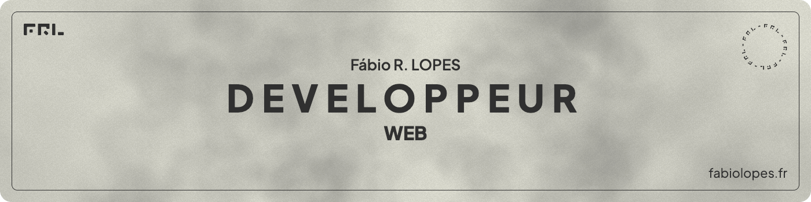

   

 

<!-- Intro  -->
<h3 align="center">
   <samp>&gt; Hey ! 👋  Je suis <b>Fabio R LOPES !</b>
   </samp>
</h3>

  <samp>&gt;
    Je suis développeur web Javascript, Node.js et Vue.js à <b>Bordeaux</b>
  </samp>

 

  
   

 
 

   <!-- <a href="https://github.com/FabioDevCode"> -->
      
      
      
      
      
      
      
      
   <!-- </a> -->

<!--
<h5>En cours d'exploration :</h5>

  

<h5>Intérêt et exploration future :</h5>

  
  
  
  
  
   

-->

<!--
 

-->

 

  <picture>
    <source media="(prefers-color-scheme: dark)" srcset="https://raw.githubusercontent.com/FabioDevCode/FabioDevCode/output/github-contribution-grid-snake-dark.svg">
    <source media="(prefers-color-scheme: light)" srcset="https://raw.githubusercontent.com/FabioDevCode/FabioDevCode/output/github-contribution-grid-snake-dark.svg">
    
  </picture>

 

<!--
  
  
-->
